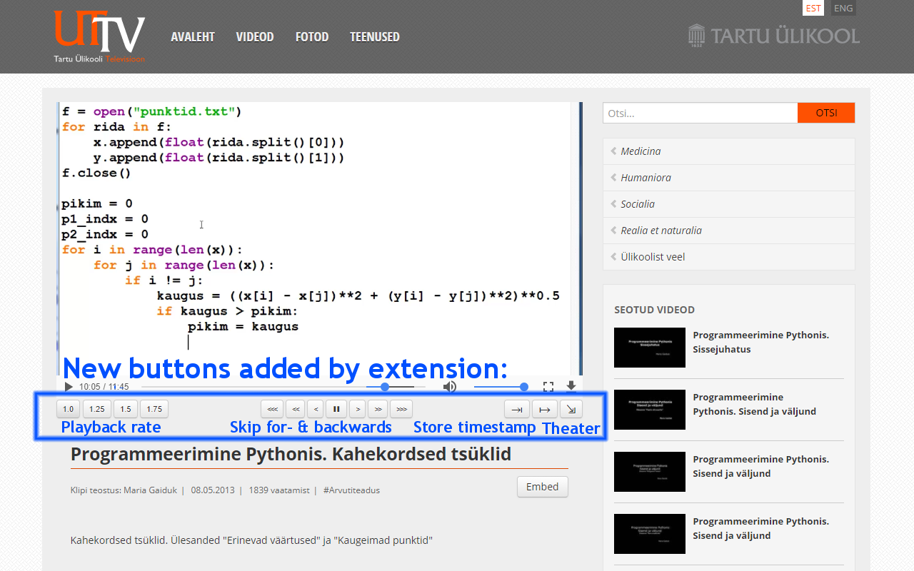
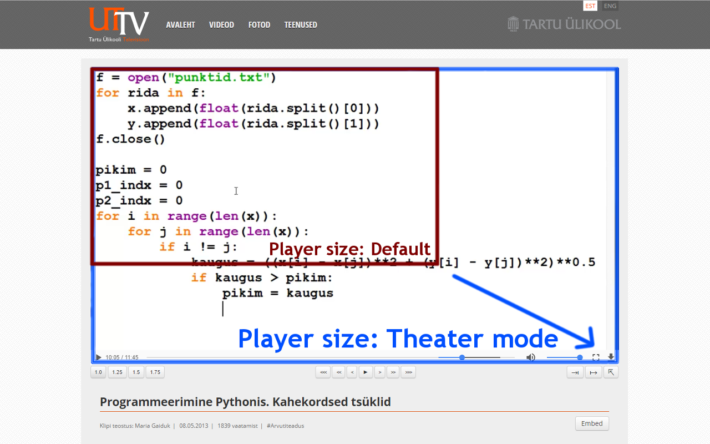

# uttv extender - Chrome extension

## Description
Extension improves uttv.ee video player keyboard shortcut support and adds keyboard shortcuts to moodle.ut.ee videos. The extension also makes it easier to download videos from uttv, moodle and panopto for offline use (keyboard shortcut: 'd').

Previous versions of the extension also added new buttons to the uttv.ee video player. After the introduction of the new uttv video player (videojs) in December 2017, this functionality became obsolete, as luckily the new player implemented most of the features added by the extension. 

Available at  https://chrome.google.com/webstore/detail/uttv-extender/kagfmcikipgjelpkepfogjgfneoehimh  

## Keyboard shortcuts  
Keyboard shortcuts added by the extension:
- change speed (playback rate): up/down arrow keys
- fast forward/backward: Shift + Left/Right arrow key (5min), Ctrl + Left/Right (60sec), Left/Right (10sec)
- jump to X%: number keys 1-9 (e.g. key 5 jumps to 50% of the video)
- play/pause: spacebar or single-click on video
- full screen: f or double-click on video 
- theater mode (uttv): t
- change volume: +/-
- mute: m
- save timestamp: s
- load timestamp: l or c
- download video: d
- embed video: e

## New buttons   (temporarily disabled)
- change video playback speed (1, 1.25, 1.5, 1.75)  
- fast forward/backward (10s, 60s, 5min)  
- save and load timestamp (enables the user to save a location in the video and return to it later, i.e. when returning to watch the video on another day)  
- theater mode (makes video player larger)  

## Screenshots
### New buttons

### Theater mode

## Change log  
### 0.0.13  
- Improve keyboard shortcut integration and remove parts of legacy code regaring buttons

### 0.0.11  
- Add keyboard shortcuts to moodle.ut.ee videos (uttv/h5p)

### 0.0.10  
- Allows downloading (keyboard shortcut: d) and opening embedded view (keyboard shortcut: e) for some moodle and panopto videos.

### 0.0.9 (29 December 2017)  
- Add partial support (keyboard shortcuts) to new UTTV video player (videojs)

### 0.0.7  
- stylized buttons  
- autohide buttons when mouse is not on video  
- added options page  (display/hide buttons, autohide buttons)  
- localisation support (estonian, english)  
- highlight button corresponding to the current video playbackrate  
- new 'icons' for timestamp and theater mode buttons  
- new logic to extract videoId  
- add shortcuts for save timestamp (S) and load timestamp (L or C)

### 0.0.6 
- fix number keys bug (from 0.0.5)  
- fully adopt ES6  

### 0.0.5  
- improved positioning (css) of moved elements when theater mode is used  
 
### 0.0.4  
- automatically shorten timestamp button text if video element is <583px to avoid splitting buttonbar to the next line  

### 0.0.3  
- added theater mode (keyboard shortcut: t)  
- improved shortcut keys co-existence with global shortcut keys  

### 0.0.2  
- fix button tooltip texts  

### 0.0.1  
Initial release  
